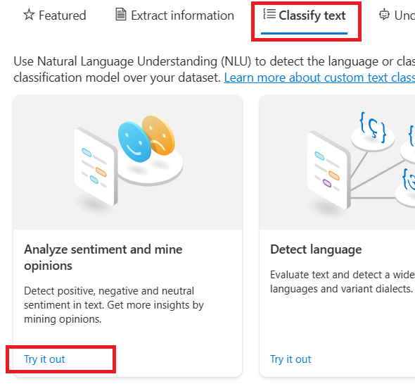

# AI-900: Análise de Sentimentos com Language Studio no Azure AI

## Descrição do Projeto

Este projeto é um dos laboratórios do Bootcamp [Microsoft Azure AI Fundamentals](https://web.dio.me/track/microsoft-azure-ai-fundamentals), promovido através da parceria entre a Microsoft e a Dio.me.

Os alunos deste bootcamp tem, como principal objetivo, se prepararem para o exame de certificação Microsoft AI-900, dominando conceitos como visão computacional, classificação inteligente de imagem e inteligência de documentos com IA, enquanto se familiarizam com as tecnologias da Microsoft Azure.

Este desafio é o de número 3 do bootcamp e consiste na execução prática de 2 exercícios, relacionados aos seguintes temas:

- [LAB 1: Azure Speech Studio](http://aka.ms/ai900-bing-copilot): experimentar os recursos do Azure AI Speech usando o Azure AI Speech Studio
- [LAB 2: Azure Language Studio](http://aka.ms/ai900-azure-openai): explorar os recursos da Linguagem de IA do Azure

 

## Acessos necessários

Para realizar estes laboratórios, é necessário criar uma [Subscrição do Microsoft Azure](https://azure.microsoft.com/)

 

## Aprovisionamento dos recursos do Azure AI Service

Para executar tanto o LAB 1 quanto o LAB 2, antes de mais nada, é necessário aprovisionar o serviço Azure IA Service.

Para realizar o aprovisionamento, realize os seguintes passos:

1) Acesse o [Azure Portal](https://portal.azure.com/) e efetue o login com a sua conta Microsoft
2) Efetue as configurações conforme apresentadas abaixo:
   
   > 

3) O serviço estará aprovisionado quando você ver a mensagem **Your deployment is complete**

   > 

 

## LAB 1 - Introdução

O serviço de Fala de IA do Azure transcreve fala em texto e texto em fala audível.

Você pode usar o AI Speech para criar um aplicativo que possa transcrever anotações de reuniões ou gerar texto a partir da gravação de entrevistas.

Neste laboratório, serão abordados os recursos do Azure AI Speech usando o Azure AI Speech Studio.

 

## LAB 1 - Explorando a conversão de voz em texto no Speech Studio

1) Acessar o [Azure AI Speech Studio](https://speech.microsoft.com/)
2) Aqui é necessário associar o AI Speech Studio ao recurso Azure IA Service, que foi aprovisionado [anteriormente](#Aprovisionamento-dos-recursos-do-Azure-AI-Service):
   
   > ***Mudar o recurso:***
   > ---
   > 

   ---
   
   > ***Selecionar o recurso:***
   > ---
   > 

3) Selecionar a *feature* **Legendar com conversão de fala em texto**:

   > 

4) Esta *feature* permite utilizar vídeos de amostra previamente carregados. Porém, optei por carregar um vídeo próprio para testar a efetividade (o vídeo que utilizei está disponível neste [link](https://github.com/rodolfoom1982/ai-900-speech-and-text-analysis/blob/main/inputs/videoSpeechToText.mp4):

   > 

Na página Introdução à Fala, em Fala para texto, localize Conversão de fala em texto em tempo real. Selecione Experimentar conversão de voz em texto em tempo real.

Introdução ao Speech

Em Escolher arquivos de áudio, selecione Procurar arquivos e navegue até a pasta onde você salvou o arquivo. Selecione WhatAICanDo.m4a e, em seguida, Abrir.

Procurar arquivos

O serviço de Fala transcreve e exibe o texto em tempo real. Se você tiver áudio no computador, poderá ouvir a gravação enquanto o texto está sendo transcrito.
Revise a saída, que deve ter reconhecido e transcrito com sucesso o áudio em texto.

Nota Se você receber uma mensagem de erro, aguarde alguns minutos antes de tentar novamente. Leva um pouco de tempo para que o recurso Fala esteja disponível para primeiro uso.

Neste exercício, você criou um recurso de Fala de IA no Speech Studio. Em seguida, você usou o serviço de conversão de fala em tempo real para texto para transcrever uma gravação de áudio. Você pôde ver a transcrição de texto sendo gerada à medida que o arquivo de áudio era reproduzido.

Arrumar
Se você não pretende fazer mais exercícios, exclua todos os recursos que não são mais necessários. Isso evita o acúmulo de custos desnecessários.

Abra o portal do Azure e selecione o grupo de recursos que contém o recurso que você criou.
Selecione o recurso e selecione Excluir e, em seguida, Sim para confirmar. O recurso é excluído.
Saiba Mais
Este exercício demonstrou apenas algumas das capacidades do serviço de Fala. Para saber mais sobre o que você pode fazer com esse serviço, consulte a página Fala.

